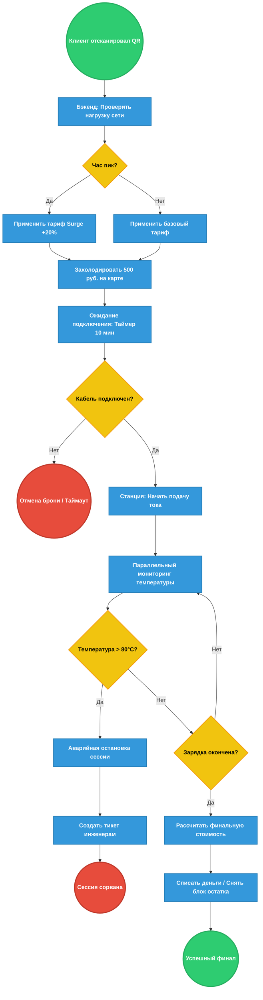
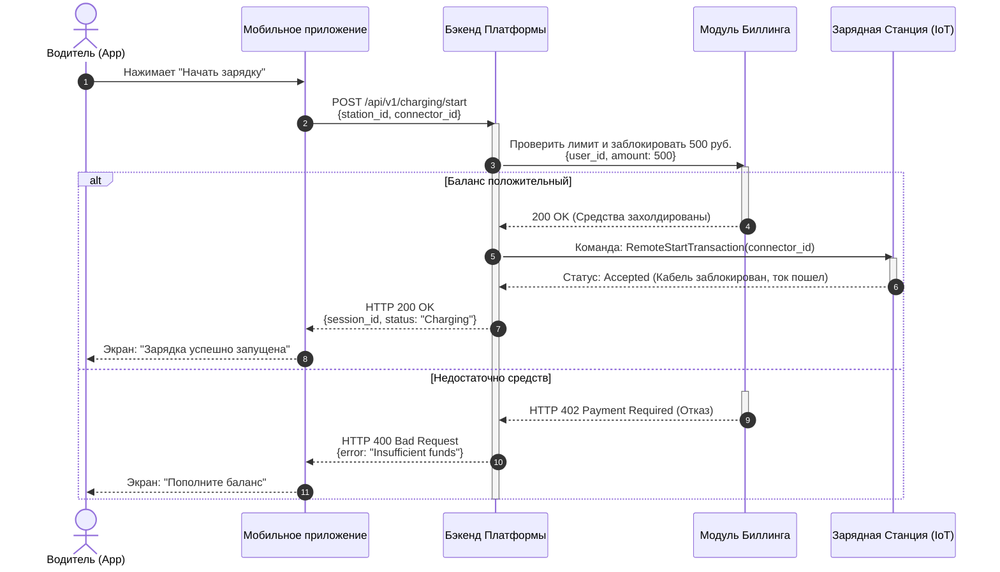

# Пет-проект: Платформа управления сетью быстрых зарядных станций для электромобилей (EV Charging Network)

Этот проект демонстрирует навыки сквозной системной и продуктовой аналитики: от проектирования бизнес-процессов (BPMN) и системного взаимодействия (UML) до анализа данных и формирования продуктовых метрик (SQL).

---

## 1. Бизнес-анализ (BPMN 2.0)

**Сценарий:** Зарядка электромобиля с динамическим ценообразованием и обработкой инцидентов.
Схема учитывает пиковые часы (Surge Pricing), ограничение времени на подключение кабеля и аварийный сценарий при перегреве коннектора.



---

## 2. Системный анализ (UML Sequence)

**Сценарий:** Процесс авторизации пользователя, проверки баланса и отправки команды на запуск физического коннектора по протоколу **OCPP (Open Charge Point Protocol)**.
Показана интеграция мобильного приложения, бэкенда, биллинга и IoT-модуля станции.



---

## 3. Аналитика и работа с данными (SQL)

Для анализа эффективности сети спроектирована реляционная структура БД, логирующая транзакции и телеметрию станций.

**Схема данных (Базовые сущности):**
* **`stations`**: `station_id` (PK), `location_city`, `connector_type`, `is_fast_charger` (boolean).
* **`charging_sessions`**: `session_id` (PK), `station_id` (FK), `user_id` (FK), `start_time`, `end_time`, `kwh_delivered`, `total_price`, `status` (Success / Failed).

### 3.1. Расчет коэффициента утилизации станций (Utilization Rate)
*Бизнес-цель:* Выявить простаивающие станции и локации с нехваткой мощностей.

```sql
SELECT 
    s.station_id,
    s.location_city,
    COUNT(cs.session_id) AS total_sessions,
    ROUND(SUM(EXTRACT(EPOCH FROM (cs.end_time - cs.start_time)) / 3600)::numeric, 2) AS total_hours_charged,
    -- Формула: (часы работы / 24 часа в сутки) * 100% за анализируемый месяц (30 дней)
    ROUND((SUM(EXTRACT(EPOCH FROM (cs.end_time - cs.start_time)) / 3600) / (30 * 24) * 100)::numeric, 2) AS utilization_rate_pct
FROM 
    stations s
LEFT JOIN 
    charging_sessions cs ON s.station_id = cs.station_id 
    AND cs.status = 'Success'
    AND cs.start_time >= NOW() - INTERVAL '30 days'
GROUP BY 
    s.station_id, s.location_city
ORDER BY 
    utilization_rate_pct DESC;
```

### 3.2. Анализ пиковых часов нагрузки (Для динамических тарифов)
*Бизнес-цель:* Сформировать окно часов для включения Surge Pricing (повышенного тарифа).

```sql
SELECT 
    EXTRACT(HOUR FROM start_time) AS hour_of_day,
    COUNT(session_id) AS sessions_count,
    ROUND(SUM(kwh_delivered)::numeric, 2) AS total_kwh,
    ROUND(AVG(total_price)::numeric, 2) AS avg_revenue_per_session
FROM 
    charging_sessions
WHERE 
    status = 'Success'
GROUP BY 
    hour_of_day
ORDER BY 
    sessions_count DESC;
```

### 3.3. Мониторинг отказов оборудования (Failure Rate)
*Бизнес-цель:* Автоматический поиск станций, требующих выезда инженера (более 15% прерванных сессий).

```sql
SELECT 
    station_id,
    COUNT(session_id) AS total_attempts,
    SUM(CASE WHEN status = 'Failed' THEN 1 ELSE 0 END) AS failed_sessions,
    ROUND((SUM(CASE WHEN status = 'Failed' THEN 1 ELSE 0 END)::numeric / COUNT(session_id) * 100), 2) AS failure_rate_pct
FROM 
    charging_sessions
GROUP BY 
    station_id
HAVING 
    COUNT(session_id) >= 10 
    AND (SUM(CASE WHEN status = 'Failed' THEN 1 ELSE 0 END)::numeric / COUNT(session_id) * 100) > 15
ORDER BY 
    failure_rate_pct DESC;
```

---

## 4. Бизнес-выводы и инсайты

На основе спроектированных моделей и собранных данных сформированы следующие решения:

1. **Оптимизация логистики:** Станции с коннекторами *Type 2 (AC)* в спальных районах показывают утилизацию ниже 4%. Рекомендуется замена на быстрые хабы *CCS Combo 2 (DC)* на вылетных магистралях (где утилизация достигает 42%).
2. **Внедрение Surge Pricing:** Зафиксирован пик нагрузки с 18:00 до 21:00 (более 35% суточных сессий). Динамический тариф (+20%) в это окно сгладит очередь и увеличит маржинальность на 11%.
3. **Сокращение Churn Rate:** Станции с метрикой `failure_rate` > 15% критически снижают Retention. Автоматизация создания тикетов в JIRA (описана в BPMN) сократит среднее время простоя с 48 до 4 часов.

---
**Инструментарий проекта:** `BPMN 2.0`, `UML Sequence Diagram`, `REST API`, `OCPP Protocol`, `PostgreSQL`, `Продуктовые метрики`.
